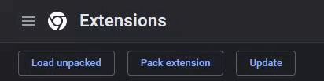

# YTS

## What is it?

This is a chrome extension to aid the use of youtube queues. It works by grabbing the current queue on the page, sorting it and playing the new sorted queue automatically.
I intend to add features, like sorting by author, video title among other things. 

## How to use

Right now, all you can do is click "generate queue". 

### Chrome store

**NOTE** This will be available when the extension is to a workable version. Expect version **1.0**

### Manual

1.
    Clone the repository
    ```sh
        git clone https://github.com/Barnold8/YTS.git
    ```
2.  Go to\
       [chrome://extensions](chrome://extensions) 
    
3.  Click "Load unpacked button" \
        
4.  Choose the **"YTS"** folder (assuming you have extracted it) \
        
5.  Enjoy!


## TODO

### Current

    * intercept youtube autoplay video change by redirection - PARTIAL
    * remove the visible queue on the YT webpage
    
### Yet to start

    * implement error handling for null queue
    * detect youtube queue update, add to extension queue, resort
    * button to clear queue


## Known bugs

    * Videos > 1hr
        * turns video queue payload in undefined. Could be rooted in time sorting code
